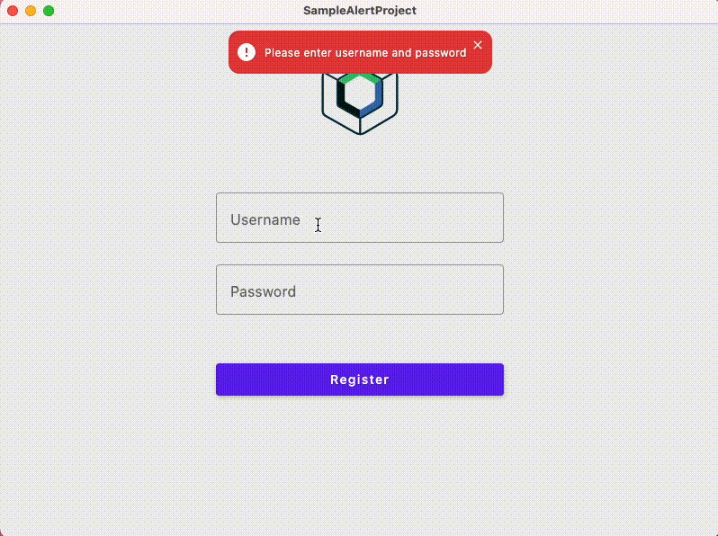

# Compose Alert Banner

[](https://kotlinlang.org) 
[](https://www.jetbrains.com/lp/compose-multiplatform) 
[](https://github.com/mofeejegi) 
[](https://opensource.org/licenses/Apache-2.0) 
[](https://android-arsenal.com/api?level=24) 
[](https://search.maven.org/artifact/com.mofeejegi.alert/alert-banner-compose-android/0.1.0-alpha03)

A **simple**, **customizable**, and **modern** library for displaying alert banners in your Jetpack Compose and Compose Multiplatform applications. Easily integrate and adapt to suit any style or use case—from error notifications to informational messages!


## Table of Contents

- [Overview](#overview)
- [Features](#features)
- [Samples](#samples)
- [Installation](#installation)
- [Usage](#usage)
- [Configuration & Customization](#configuration--customization)
- [Contributing](#contributing)
- [License](#license)
- [Contact](#contact)

## Overview

**Compose Alert Banner** is a Kotlin library powered by Compose Multiplatform, dedicated to providing developers an easy and elegant way to add alert banners to their applications. This library comes with a robust set of features, allowing your alert banners to be as simple or as sophisticated as needed.

Whether you need to show warnings, confirmations, or general notifications, Compose Alert Banner provides an intuitive API and customizable components that blend seamlessly with your app’s UI.

## Features

- **Modular Design:** Easily integrate into your existing Compose projects.
- **Customizability:** Fully customizable UI components with support for custom icons, colors, and typography.
- **Simplicity:** Minimal setup required—get started with just a few lines of code.
- **Animation Ready:** Animate your banners for a more engaging user experience.
- **Lightweight:** Minimal impact on your build size and runtime performance.

## Samples

Here's how it looks:

<table>
  <thead>
    <tr>
      <th>Android</th>
      <th>iOS</th>
      <th colspan="2">Desktop</th>
    </tr>
  </thead>
  <tbody>
    <tr>
      <td></td>
      <td></td>
      <td colspan="2"></td>
    </tr>
  </tbody>
</table>

## Installation

[](https://search.maven.org/artifact/com.mofeejegi.alert/alert-banner-compose-android/0.1.0-alpha03)

Compose Alert Banner is available as a Gradle dependency on `mavenCentral`. You can add it to your project by including the following in your `build.gradle.kts` file:

```kotlin
repositories {
    mavenCentral()
}

dependencies {
    implementation("com.mofeejegi.alert:alert-banner-compose:<latest-version>")
}
```
Replace `<latest-version>` with the current release version available in the [Releases](https://github.com/mofeejegi/compose-alert-banner/releases) section.

## Usage

Integrating the alert banner into your Compose application is straightforward. Below is a simple example to get you started:

```kotlin
@Composable
fun MyApp() {
    MaterialTheme {
        AlertBanner(darkTheme = false) { // Declare this at the root of your application

            // This is accessible at any part of your application
            val alertManager = rememberAlertManager()

            Column(modifier = Modifier.fillMaxSize()) {
                Button(onClick = { alertManager.show("Error", AlertBannerType.Error) }) {
                    Text("Show Error Alert")
                }

                Button(onClick = { alertManager.show("Success", AlertBannerType.Success) }) {
                    Text("Show Success Alert")
                }
            }
        }
    }
}
```

## Configuration & Customization

Compose Alert Banner offers multiple configuration options:

- **Theme Customization:** Override default color schemes and typography.
- **Icon Support:** Use any [Material Icon](https://fonts.google.com/icons) or your own custom vector to match your design.
- **Animation:** Configure entrance and exit animations for the banner.
- **Callbacks:** Implement custom click or dismiss callbacks to run your own business logic.

## Contributing

Contributions, issues, and feature requests are welcome! Please:

1. **Fork** the repository.
2. **Create a branch** (`git checkout -b feature/YourFeature`).
3. **Commit your changes** (`git commit -am 'Add new feature'`).
4. **Push to the branch** (`git push origin feature/YourFeature`).
5. **Open a pull request** describing your changes.

Be sure to follow the existing code style and include tests where applicable.

## License

This project is licensed under the [Apache License 2.0](./LICENSE). See the [LICENSE](./LICENSE) file for details.

## Contact

For questions or suggestions, open an issue or reach out directly:

- **Maintainer:** [mofeejegi](https://github.com/mofeejegi)
